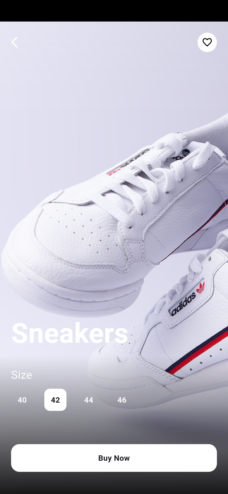

# shoes_shop_app

This Shoe Store App delivers a clean, modern shopping experience designed with Flutter. Browse trending shoes, filter by category, and view detailed product pages with smooth hero animations. Built to showcase elegant UI structure, responsive layouts, and seamless navigation — perfect for e-commerce concepts and design inspiration

## Screenshots

  
  
  
  
  

## Getting Started

This project is a starting point for a Flutter application.

A few resources to get you started if this is your first Flutter project:

- [Lab: Write your first Flutter app](https://docs.flutter.dev/get-started/codelab)
- [Cookbook: Useful Flutter samples](https://docs.flutter.dev/cookbook)

For help getting started with Flutter development, view the
[online documentation](https://docs.flutter.dev/), which offers tutorials,
samples, guidance on mobile development, and a full API reference.
